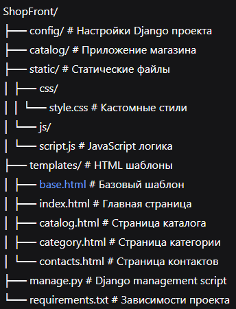

# ShopFront - Интернет-магазин


Простое веб-приложение интернет-магазина на Django с современным интерфейсом на Bootstrap.

## 🚀 Возможности

- **Главная страница** - список товаров с карточками
- **Страница контактов** - форма обратной связи и контактная информация
- **Адаптивный дизайн** - работает на всех устройствах
- **Сайдбар-меню** - удобная навигация по сайту
- **Обработка форм** - прием и обработка данных с формы обратной связи

## 🛠️ Технологии

- **Backend:** Django 4.2
- **Frontend:** Bootstrap 5.3
- **Язык:** Python 3.8+
- **Стили:** CSS3
- **Иконки:** Bootstrap Icons

## 📁 Структура проекта


text

## ⚡ Быстрый старт

### 1. Клонирование и установка

```bash
# Создайте виртуальное окружение
python -m venv venv
# Активируйте окружение
# Linux/Mac:
source venv/bin/activate
# Windows:
venv\Scripts\activate
# Установите зависимости
pip install -r requirements.txt
```
### 2. Настройка базы данных
```bash
# Примените миграции
python manage.py migrate
```
### 3. Запуск сервера
```bash
# Запустите development сервер
python manage.py runserver
```

# Откройте в браузере
http://127.0.0.1:8000/
## 🌐 Доступные страницы
- Главная: / - список товаров

- Каталог: /catalog/ - полный каталог товаров

- Категория: /category/ - товары по категориям

- Контакты: /contacts/ - форма обратной связи

- Админка: /admin/ - панель администратора

## 🎨 Особенности интерфейса
- Современный дизайн на Bootstrap 5

- Адаптивная верстка для мобильных устройств

- Интерактивное меню с подсветкой активной страницы

- Карточки товаров с изображениями и описанием

- Форма обратной связи с валидацией

## 📝 Форма обратной связи
Форма на странице контактов отправляет POST-запрос на /submit-form/ и выводит данные в консоль сервера.

## 🔧 Настройки
Основные настройки проекта находятся в config/settings.py:
 
- Подключение статических файлов

- Настройки шаблонов

- Настройки базы данных (по умолчанию SQLite)

- Настройки времени и языка

## 🤝 Разработка
Для разработки рекомендуется:

- Активировать виртуальное окружение

- Установить зависимости из requirements.txt

- Использовать python manage.py runserver для тестирования

- Применять миграции при изменении моделей